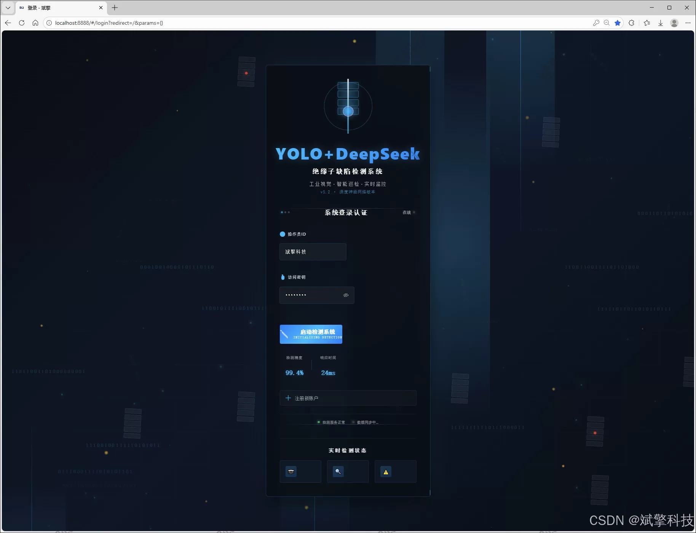
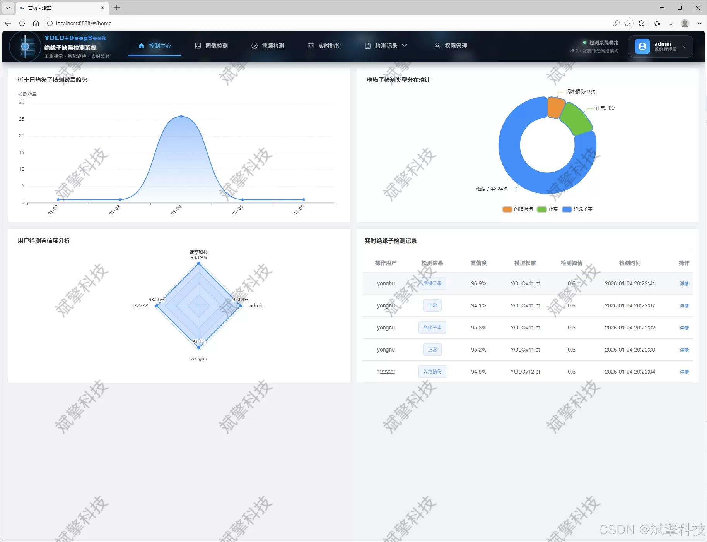
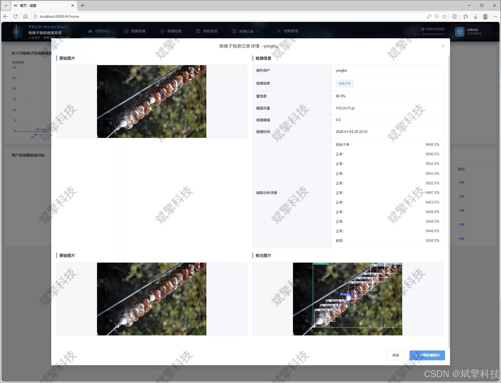
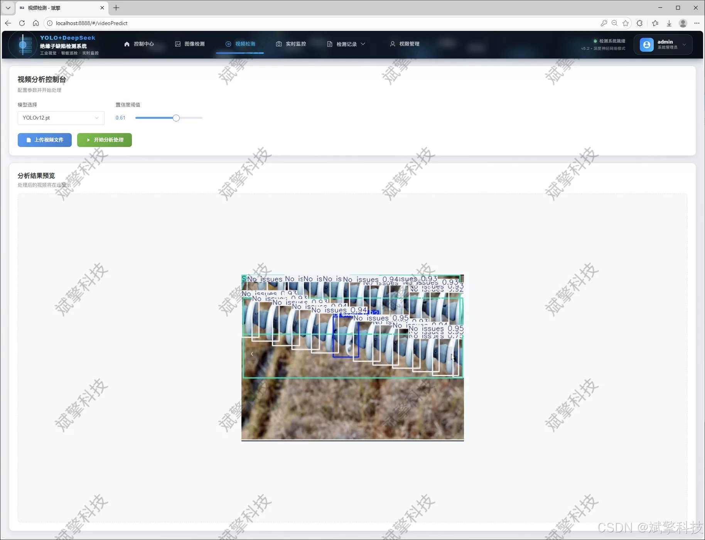
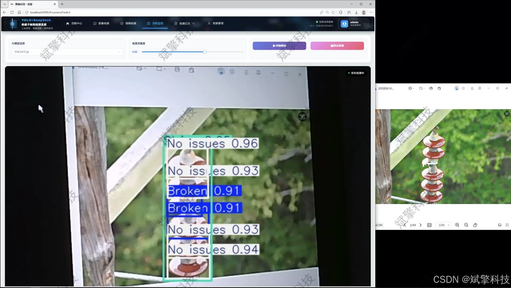
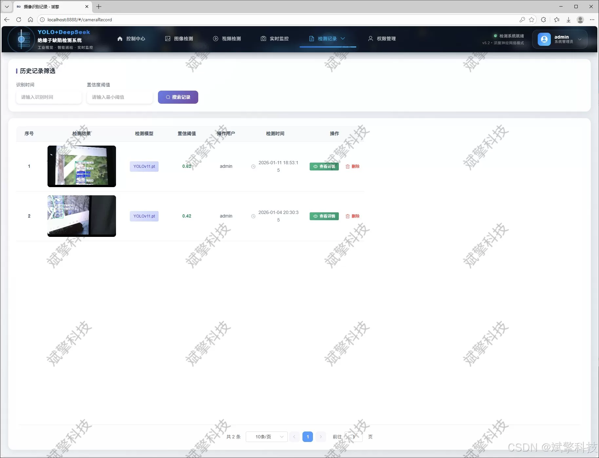
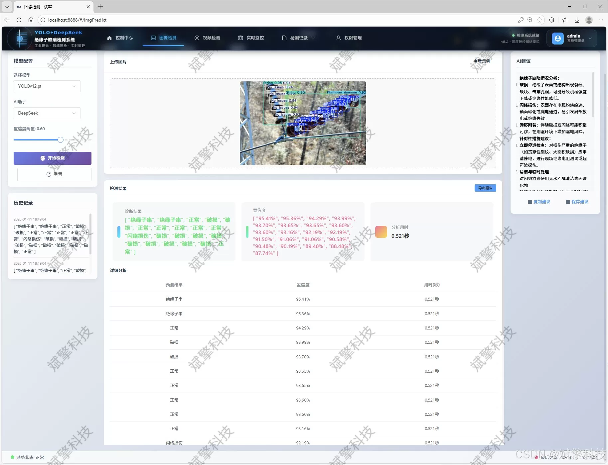
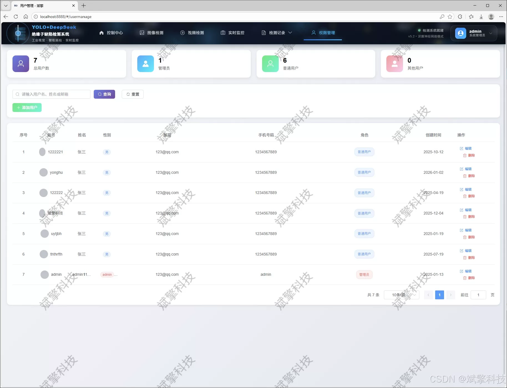
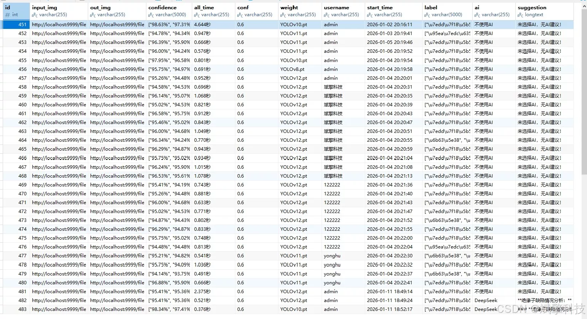

# YOLO+DeepSeek insulator defect detection

## Body

YOLO+DeepSeek Insulator Defect Detection System Based on YOLO Deep Learning and the Large Model of Qianwen and DeepSeek (DeepSeek Intelligent Analysis + web interaction interface + front-end and back-end separation + YOLO data + YOLOv8/YOLOv10/YOLOv11/YOLOv12)

The project aims to design and implement a "Intelligent Insulator Defect Detection and Analysis System" that integrates advanced target detection algorithms, modern Web interfaces, and intelligent analysis. The core technology layer of the system adopts the latest models from the YOLO series (including YOLOv8, YOLOv10, YOLOv11, and YOLOv12), building a high-performance, switchable visual detection engine specifically for accurately identifying and positioning the four typical states of insulators in complex background aerial or ground inspection images/videos: 'Insulator String' (normal), 'Good Single Piece' (no defect), 'Broken', and 'Flashover Damage'. Based on a self-constructed dataset containing 3200 high-quality labeled images (2240 training set, 640 validation set, and 320 test set), we have conducted thorough training and optimization of the model to ensure its robustness in real-world scenarios.

The application layer of the system adopts a modern architecture that separates the frontend and backend. The back-end is built on the SpringBoot framework, responsible for core business logic, model inference interfaces, user authentication, and data persistence. The frontend provides a friendly interactive Web interface, supporting users to perform convenient operations. The data layer uses MySQL database, systematically storing user information, model configuration, as well as all detection tasks (images, videos, real-time cameras) history and detailed results, providing data foundation for state tracking and statistical analysis.

Functional module

✅ User Login and Registration: Supports password detection, saves to MySQL database.

✅ Supports four YOLO model switches, YOLOv8, YOLOv10, YOLOv11, YOLOv12.

✅ Information Visualization, Data Visualization.

✅ Image detection supports AI analysis functions, deepseek and Qianwen.

✅ Supports image detection, video detection, and real-time camera detection. The results are saved to a MySQL database.

✅ Picture recognition record management, video recognition record management and camera recognition record management.

✅ User Management Module, administrators can add, delete, modify, and query users.

✅ Personal center, can modify their own information, password name profile picture and so on.

There is no Lunwen writing service, nor any Lunwen.

## Images

## Payment

Here is a pay link on Stripe ( https://buy.stripe.com/3cs8yP7sY87d0vu9AB ). Please contact me lonlonago@foxmail.com after funding $89, and I will send you a complete data files , thank you!

